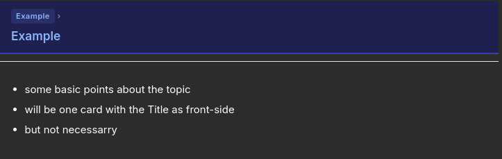
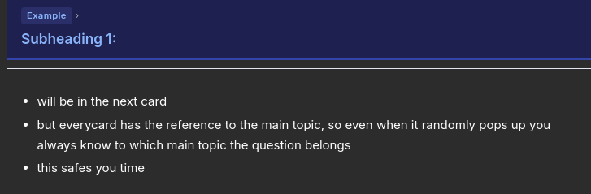
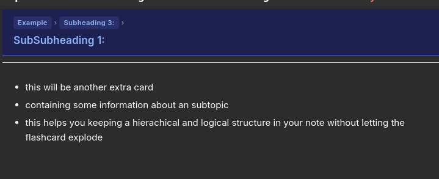
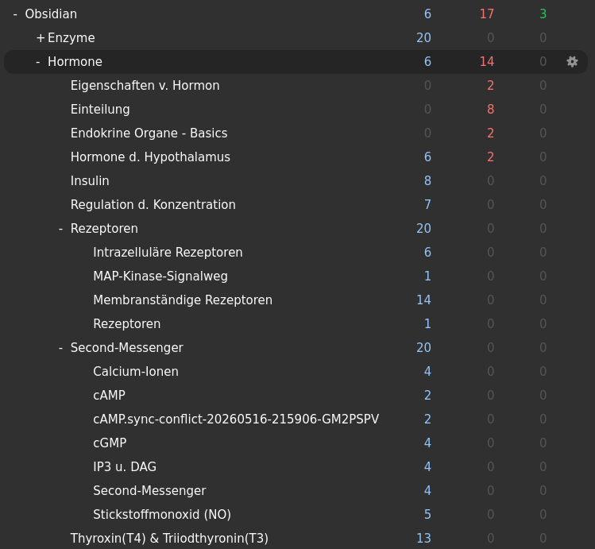

# Result of the Example.md

## The Basic Card with no Subheading:

## The Subheading Card:

## The SubSubheading Card:

## A more complex deck:
Because i converted only one file for the demo, its not a very complicated deck.
Here a screenshot of a deck i created via the Folder Option

