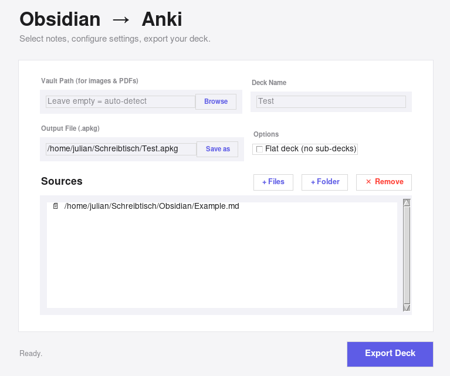

# ObsidianNotes2Anki
A Simple vibe coded python Skript that converts your structured Notes into an organized Anki-Deck with Subdecks. 

## Idea:
During my studies I really lost control about the best tactics on how get all the lectures, lessons, information, facts, concept and all that things in my head. I ended up using Anki for Spaced Repetition and Active Recalling. Anki is PERFEKT for that. 
### BUT:
I really hated it having all my cards unsorted in big decks, each information stored anywhere in this huge stack of knowledge, spawning randomly during my learning sessions without any logical structure. I also hate learning from randomly given facts that apperars somewhere without real context and made me more confusing than actually understanding the subject.

Thats why i switched to Obsidian to kinda sort my Notes, Summaries, PDFs and everything. But with one Disadvantage: I was to lazy to recall the once sorted notes and summaries. Instead I continued with new topics and prograstinated way tooooo much.

To prevent that i searched for a way to convert my well strucutred Notes into an Anki Deck. Even though there are plenty of AWESOME Plugins, i hated the idea of formating my Notes in a Flashcard Style because my OCD always forces me to keep that clean HANDOUT-LIKE-STYLE and visible flow in my notes. 

**THATS WHY** i vibe coded this script. (First i tried to code it all by myself, but after hours of bug fixing and research i ran out of time -my exams keep getting closer- so i asked AI to help me with this)

## Features:
- Converts your strutured notes or folders into Anki Decks
- Supports single file, multiple file or hierachical folder structures
- Supports embedded images via ![[]]
- Supports embedded PDF-Snippets from the PDF++ Plugin in Obsidan (![[file.pdf#page=9&rect=51,32,487,459]]) (Its supereasy for drag and drop pdf-snipptes from lectures to your notes)
- Creates an importable Anki Deck with Subdecks according to the Folder-structure

## Note formatation:
I alway format my notes the following:
[Example](Example.md)

See how it came out: [Demo Outcome](Demo_Result.md)

### How it baisicly works:
The Script scans your given Sources for Markdown files. For every File it creates a Sub-deck. Every new h3 or h4 heading will be a new card with its bullet points on the back. h3 blocks that includes h4 blocks will also be split up. The front page of the card contains the Subheading and also some higher Headings of higher hierachy. Thats practical if you wanna knwo which main topic belongs to the given card. 
If you have PDF-Snippets or images Embedded, the script searches for the original files in your vault and embedd them into your Card. 
The card also gets formated: Hyperlinks will be removed, it only displays the link as normal text. Bold text will stay the same. 

## Installation:
### 1.) Download the Repo

### 2.) Install dependencies:
   #### Python Modules:
   
   pip install pdf2image Pillow

   #### pdftoppm:

   ##### macOS
brew install poppler

##### Ubuntu/Debian
sudo apt install poppler-utils

##### Windows: 
poppler-Binaries from https://github.com/oschwartz10612/poppler-windows/releases

### 3.) Run the GUI python script

## Feel free to do with this whatever you want, I hope it helps improve your study workflow and safe time (hopefully more than you invested in setting this up and get comfortable with)
I gave up understanding how everything works, I am glad it does what I need, but feel free to improve, develop and correct it :)
   
